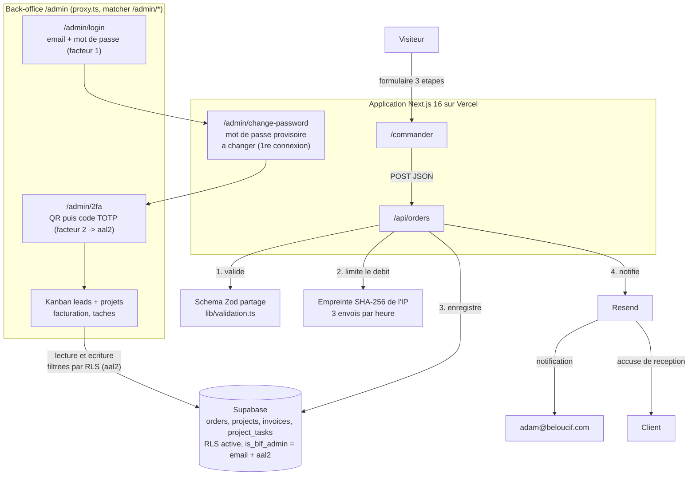

# BLF Lab's - site officiel

Version 0.10.0

<!-- adam-badges:start -->
[](https://github.com/Adam-Blf/blf-labs-site/actions/workflows/ci.yml)
[](https://github.com/Adam-Blf/blf-labs-site/commits)
[](https://hits.sh/github.com/Adam-Blf/blf-labs-site/)
[](https://github.com/Adam-Blf/blf-labs-site/commits)
[](https://github.com/Adam-Blf/blf-labs-site)
[](LICENSE)
<!-- adam-badges:end -->

Site vitrine et tunnel de commande du studio **BLF Lab's**, publie sur
**beloucif.com**. Une demande envoyee depuis le site est enregistree en base,
notifiee par email au studio, et confirmee au client par un accuse de reception.

## Sommaire

- [Architecture](#architecture)
- [Direction artistique](#direction-artistique)
- [Demarrer](#demarrer)
- [Variables d'environnement](#variables-denvironnement)
- [Emails et DNS](#emails-et-dns)
- [Scripts](#scripts)
- [Verification](#verification)
- [Choix structurants](#choix-structurants)

## Architecture



Le point important : l&rsquo;etape 5 ne peut pas faire echouer l&rsquo;etape 3.
Si Resend est indisponible ou mal configure, la demande reste enregistree et le
drapeau `mail_sent` garde la trace de la relance a faire. Perdre une demande
client parce qu&rsquo;une variable d&rsquo;environnement manque serait la pire
des pannes silencieuses.

## Direction artistique

Huit directions completes ont ete maquettees sur la vraie page d&rsquo;accueil,
puis departagees sur captures. La retenue est la direction **"laboratoire"**,
posee en classe `.dir-labs` : angles droits, filets fins de 1 px, aplats francs,
titres en capitales dans la largeur variable d&rsquo;Archivo. Palette encre
`#111016`, neige `#edeef1`, violet `#cb6ce6` et citron `#d9fb50`.

Trois choses sont exclues par principe, parce qu&rsquo;elles signent une
interface generee plutot qu&rsquo;une interface dessinee : **le degrade**, le
**verre depoli** et le **halo de couleur diffuse** derriere un titre. La classe
`.grad-text` porte donc un aplat de violet et non un degrade, et les disques
flous du hero ont ete remplaces par la grille millimetree de la paillasse.

Elle vit dans `app/themes.css` sous forme de jetons : couleurs, rayon, epaisseur
de trait, ombre, police de titre, casse et rythme vertical. **Aucun composant ne
code un style en dur** : ils lisent les classes `blk`, `title`, `section`,
`rule-b`. Changer de direction ne demande donc de toucher aucun composant.

### Effets

Trois effets se greffent sur cette direction sans la modifier, et chacun se
retire sans laisser de trou :

- **Scene 3D du hero** (React Three Fiber). La fiole du logo en volume, avec une
  refraction reelle. Elle ne se charge pas du tout sans WebGL 2.0, sous
  `prefers-reduced-motion`, ou quand `Save-Data` est demande : le repli est
  l&rsquo;etat par defaut, et c&rsquo;est la grille qui reste. Ni `three` ni
  `drei` n&rsquo;entrent alors dans le paquet initial.
- **Barre de navigation en verre refractif**. Une carte de deplacement SVG
  courbe l&rsquo;arriere-plan sans le flouter, tant que la page n&rsquo;a pas
  defile. Des qu&rsquo;un contenu passe dessous, la barre redevient opaque :
  au-dessus d&rsquo;un texte qui glisse, une barre translucide est illisible.
- **Revelation au defilement** (GSAP ScrollTrigger). Rien n&rsquo;est masque en
  CSS : l&rsquo;etat visible est l&rsquo;etat naturel du document, donc une
  panne de script ne produit jamais une page blanche.

Le mouvement reduit est traite en JavaScript et pas seulement en CSS : le bloc
`@media (prefers-reduced-motion: reduce)` annule des durees de transition, il
n&rsquo;arrete ni une boucle WebGL ni un `requestAnimationFrame`.

Regle de contraste heritee d&rsquo;un projet precedent : `--accent-ink` et
`--support-ink` sont invariants par theme. Tout texte pose sur un aplat les
utilise, jamais `--ink`, sans quoi il s&rsquo;inverse en mode sombre alors que
l&rsquo;aplat, lui, ne bouge pas.

Le logo est un bloc typographique ou **la fiole de laboratoire remplace le A de
LAB'S** : une fiole d&rsquo;Erlenmeyer a la silhouette d&rsquo;un A et son niveau
de liquide en fait la barre.

## Demarrer

```bash
npm install
npm run dev     # http://localhost:3200
npm run build
```

Le port 3200 est reserve a ce projet dans le registre de ports local.

## Variables d'environnement

Aucune n&rsquo;est obligatoire pour lancer le site : sans elles il tourne en mode
degrade, et le formulaire indique une alternative par email.

| Variable | Role | Sans elle |
|---|---|---|
| `RESEND_API_KEY` | Envoi des emails | Aucun email, la demande reste en base |
| `RESEND_FROM` | Adresse d&rsquo;expedition | Valeur par defaut `contact@send.beloucif.com` |
| `SUPABASE_URL` | Base de donnees | Aucune ecriture, seul l&rsquo;email part |
| `SUPABASE_SERVICE_ROLE_KEY` | Ecriture serveur | Idem. **Jamais cote client** |
| `NEXT_PUBLIC_SUPABASE_URL` | Authentification admin | `/admin` inaccessible |
| `NEXT_PUBLIC_SUPABASE_ANON_KEY` | Authentification admin | `/admin` inaccessible |
| `ADMIN_EMAILS` | Liste blanche du back-office | Personne n&rsquo;entre |
| `IP_HASH_SALT` | Sel de l&rsquo;empreinte d&rsquo;IP | Sel par defaut, a definir en production |
| `NEXT_PUBLIC_GA_ID` | Mesure d&rsquo;audience GA4 | Aucune mesure, et **aucun bandeau de consentement** |

## Emails et DNS

Les emails partent du domaine `beloucif.com` verifie chez Resend (region
Irlande). Trois enregistrements sont necessaires, poses automatiquement dans la
zone OVH :

- `TXT resend._domainkey` : signature DKIM
- `MX send` et `TXT send` : chemin de retour et SPF, **sur le sous-domaine**

Ce point compte : Resend place son SPF sur `send`, pas sur la racine. Les
enregistrements MX de `beloucif.com` restent donc intacts et la boite
`adam@beloucif.com` continue de fonctionner. Le script refuse d&rsquo;ecrire un
MX a la racine, precisement pour eviter cet accident.

## Scripts

Tout asset genere a son script reproductible, aucun n&rsquo;embarque de secret :

| Script | Role |
|---|---|
| `scripts/fetch_fonts.py` | Rapatrie les polices en local (aucun CDN) |
| `scripts/fetch_icons.py` | Recupere les pictogrammes Icons8 et les convertit en composants React |
| `scripts/ovh_dns.py` | Consulte et modifie la zone DNS de beloucif.com |
| `scripts/setup_email_dns.py` | Lit les enregistrements exiges par Resend et les pose chez OVH, de facon idempotente |
| `scripts/check_encoding.py` | Garde : UTF-8 propre, sans BOM ni mojibake. Executee en CI |
| `scripts/check_french.py` | Garde : accents manquants dans le texte visible. `--fix` pour appliquer. Executee en CI |
| `scripts/clean_svg.py` | Retire les metadonnees des SVG exportes de Canva |
| `scripts/capture_shots.py` | Recapture les realisations en ligne, guide d'introduction et bandeau cookies ecartes, et ecrit les vignettes WebP |

Les identifiants sont lus dans un fichier d&rsquo;environnement **hors depot**
et ne sont jamais affiches, meme en cas d&rsquo;erreur.

## Choix structurants

- **Aucun CDN.** Polices et pictogrammes sont servis par le site. Une page
  s&rsquo;affiche a l&rsquo;identique sans acces internet sortant, et aucune
  requete ne part vers un tiers au chargement.
- **La validation fait foi cote serveur.** Le formulaire et l&rsquo;API
  partagent le meme schema Zod ; le controle cote navigateur n&rsquo;est
  qu&rsquo;un confort.
- **Les invariants vivent en base.** RLS est active sur `orders` et aucune
  policy n&rsquo;autorise le role anonyme : meme si la cle publiable fuite, la
  table reste illisible depuis un navigateur.
- **Aucune adresse IP en clair.** Seule une empreinte SHA-256 salee est stockee,
  suffisante pour limiter le debit, insuffisante pour identifier quelqu&rsquo;un.
- **Consentement jamais pre-coche**, et aucun traceur, donc aucun bandeau
  cookies a afficher.

## Licence

MIT, voir [LICENSE](LICENSE).

## Verification

Le depot ne se relit pas a la main. Un workflow GitHub Actions rejoue a chaque
poussee et a chaque pull request : types, lint, tests, encodage, accents, build,
plus une garde typographique qui refuse tiret cadratin, demi-cadratin et
mediopoint dans le contenu publie.

```bash
npm run typecheck && npm run lint && npm test
npm run check:encoding && npm run check:french
npm run build
```

Les etapes sont independantes : un run signale **tout** ce qui casse, pas
seulement la premiere erreur rencontree.

Ce que la CI ne voit pas, et qu&rsquo;il faut donc regarder soi-meme : le rendu.
Aucune de ces etapes ne dit si une scene 3D deborde du cadre ou si une barre de
navigation devient illisible. Les deux sont arrives, et c&rsquo;est la capture
d&rsquo;ecran qui les a trouves, pas le build.
